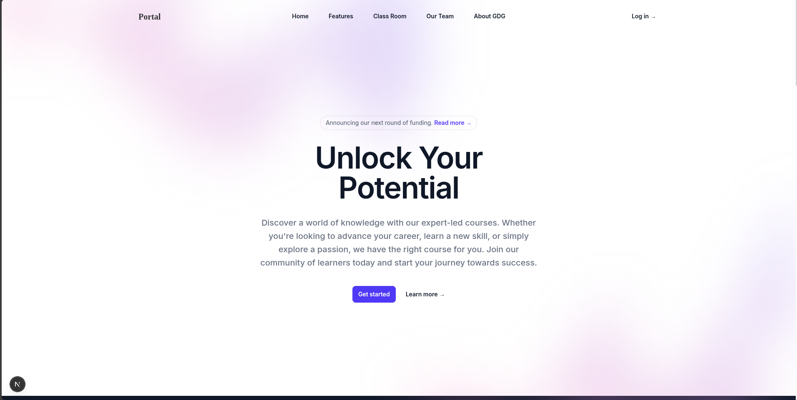
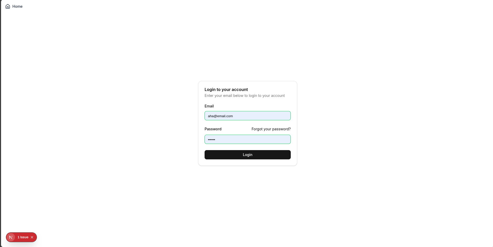
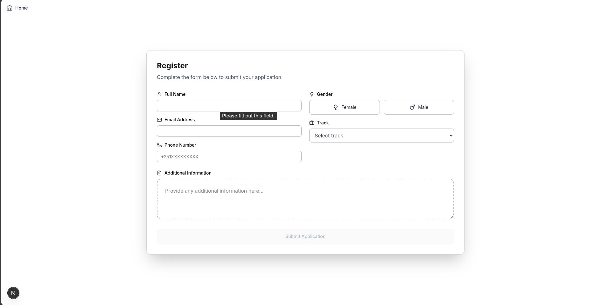
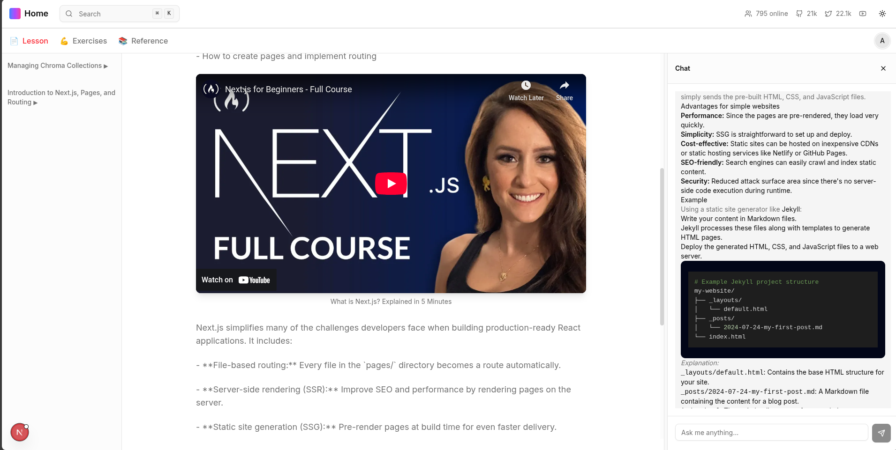
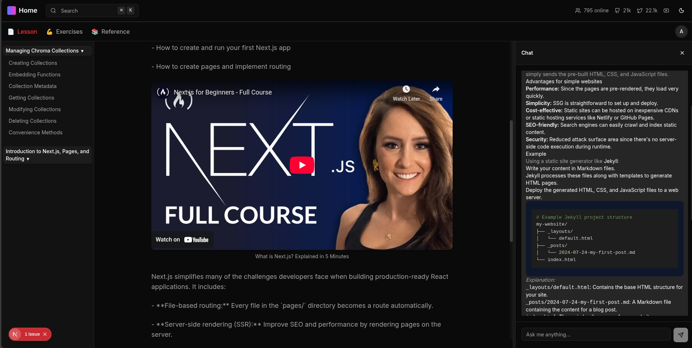
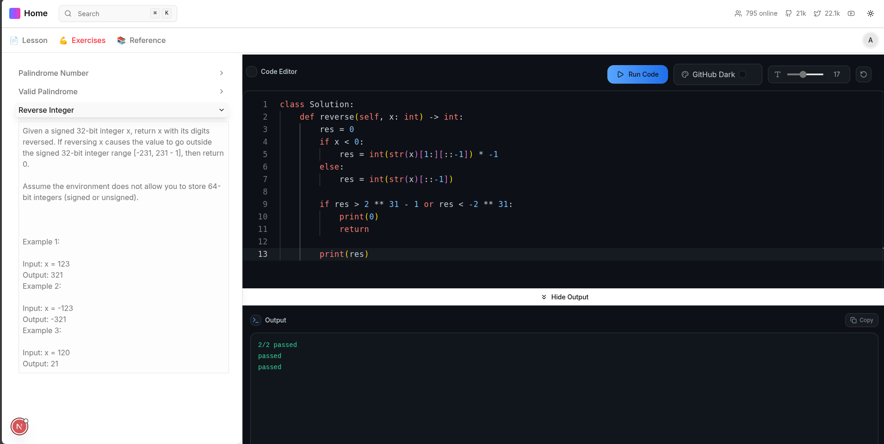
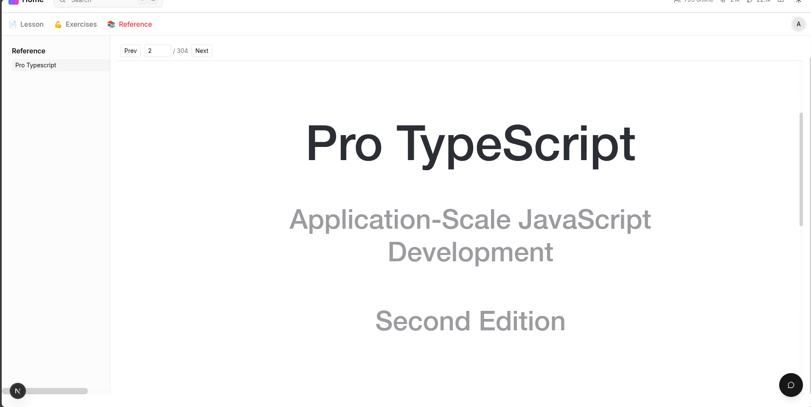
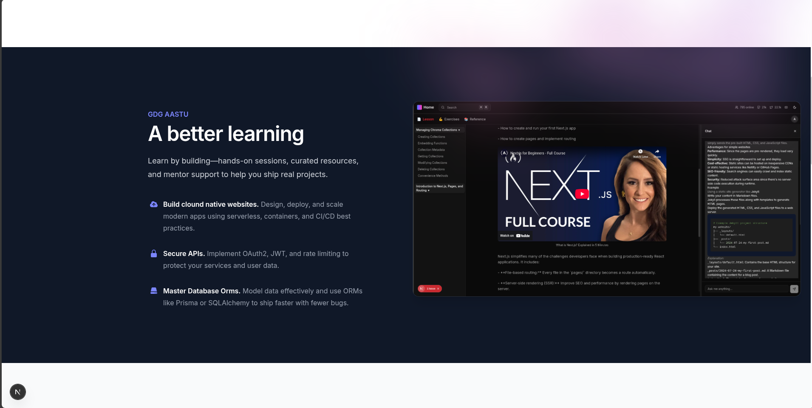
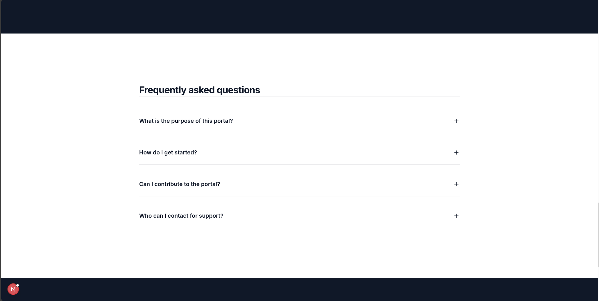

# Portal

A modern classroom and mentor portal built with Next.js 15, React 19, and Tailwind CSS. It provides authentication, a classroom with lessons, exercises, reference materials (PDF/Markdown), a mentor area, charts and tables, dark mode, and a responsive, accessible UI.

## Screenshots

> Images are stored in `public/` and referenced directly.

- Home / Hero

  

- Auth (Login & Register)

  

  

- Classroom (Lessons, Exercises, Reference)

  

  <!--  -->

  

- Resources & Features

  

  

  

## Features

- Authentication
  - Login and Registration flows
  - OTP support endpoints prepared (`/otp`, `/otp/verify`)
  - Cookie-based token attached to API requests
- Classroom
  - Lessons: render Markdown from `public/resources/*.md`
  - Exercises: interactive coding with Monaco editor and resizable panels
  - Reference: built-in PDF viewer for docs in `public/resources/*.pdf`
  - Chat widget with streaming responses
- Mentor area
  - Mentors listing and data-driven pages (`app/mentors`, `app/mentors/data.json`)
- UI/UX
  - Dark/Light theme toggle
  - Sidebar layout, tabs, tables, charts, tooltips, toasts
  - Responsive and accessible components
- Data viz + tables
  - Recharts for charts, TanStack Table for data tables
- State & forms
  - Zustand store for editor/state, React Hook Form + Zod validation

## Tech Stack

- App: Next.js 15 (App Router), React 19, TypeScript
- Styling: Tailwind CSS v4, tailwindcss-animate
- UI: Radix primitives, custom/shadcn-style components
- State: Zustand
- Forms/Validation: React Hook Form + Zod
- Editor: Monaco
- Docs: react-markdown + remark-gfm + rehype-raw
- PDFs: @react-pdf-viewer/core + default-layout
- Charts: Recharts
- Tables: @tanstack/react-table
- Misc: axios, js-cookie, next-themes, sonner

## Routes

- `/` – Landing page
- `/login`, `/register` – Auth pages
- `/class-room` – Classroom hub (lessons, exercises, reference)
- `/mentors` – Mentors listing

## Local Development

Prerequisites:

- Node.js 20+
- pnpm (recommended) or npm/yarn

Install and run:

```bash
pnpm install
pnpm dev
```

Build and start production:

```bash
pnpm build
pnpm start
```

Lint:

```bash
pnpm lint
```

## Environment

Create `.env.local` in the project root:

```env
# Backend base URL for axios
BASE_DEV_URL=http://localhost:8888
```

Notes:

- Auth token is read from the `access_token` cookie and attached to outgoing API calls (except public endpoints like `/login`, `/register`, `/otp`, `/otp/verify`).

## Content & Assets

- Lessons/Docs/Resources: `public/resources/`
  - Markdown: `lesson1.md`, `lesson2.md`, `lesson3.md`, `questions*.md`
  - PDFs: `tlt.pdf`, `docs-*.pdf`
  - Index: `lessons.json`
- App images used in this README live in `public/`.

## Project Structure (high level)

- `app/` – App Router pages (home, login, register, class-room, mentors)
- `components/` – UI components and feature modules (auth, class-room, mentor, ui)
- `lib/` – Data fetching, loaders, utilities, stores
- `public/` – Static assets (images, resources)
- `types/` – Shared TypeScript types

## Scripts

- `dev` – Run the dev server
- `build` – Build the production app
- `start` – Start the production server
- `lint` – Lint the codebase

## License

This project is provided as-is for educational/demo purposes. Ensure you have rights to any content you deploy.
